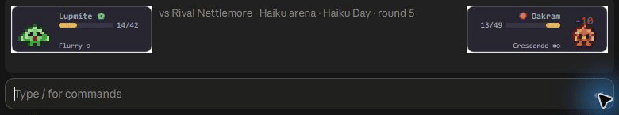
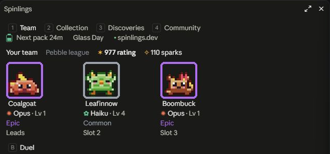
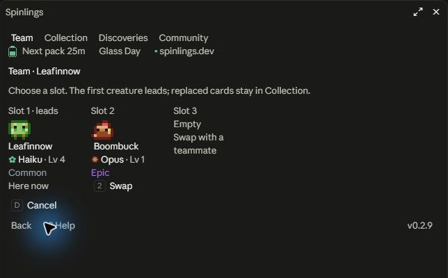
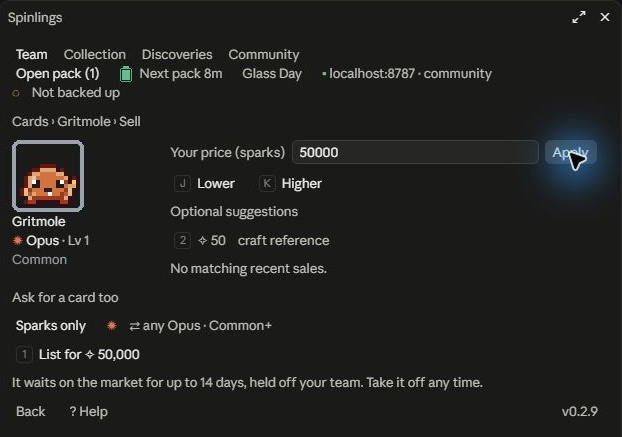
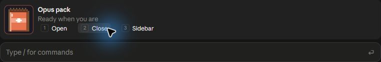

# Spinlings

**Tiny pixel creatures that battle above your prompt while Claude works.**

[](https://github.com/416rehman/spinlings/actions/workflows/ci.yml)
[](https://github.com/416rehman/spinlings/releases/latest)
[](LICENSE)
[](#install)

[Website](https://spinlings.dev) · [Install](#install) · [How to play](docs/how-to-play.md) · [What's new](CHANGELOG.md)

Spinlings is a creature card game that lives inside Claude Code. While Claude works, wild creatures rustle into a slim band above the prompt and your team of three battles them. Win, and you might catch one. Every card is one of a kind, with its own look, genes and traits. You can fuse two cards into a hybrid nobody has seen before, trade, sell or gift cards to other players, challenge them to duels and climb the global leaderboards.

The world lives at [spinlings.dev](https://spinlings.dev), or entirely on your machine if you play offline.

<p align="center">
  
</p>

- **Your team is ready.** Start with three creatures and a random handle like `soft-otter-42`. A passkey brings your collection to another computer.
- **Battles play themselves.** Your creatures fight while Claude works. Press 1 when a special fires for a Perfect hit.
- **Playable alone.** Generated Rivals and a Wandering Trader fill in whenever no other player is around, so the game works on day one.
- **Free.** Nothing to buy, and cards have no cash value.
- **Open source** (MIT), mod and server.

## Install

Two commands inside Claude Code, one at a time:

```
/plugin marketplace add 416rehman/spinlings
/plugin install spinlings@spinlings
```

Or just ask Claude: *install the Spinlings mod from 416rehman/spinlings*. From a shell, the same is:

```sh
claude plugin marketplace add 416rehman/spinlings
claude plugin install spinlings@spinlings
```

**Requires Claude Code 2.1.287 or later.** Run `claude --version` to check, or `claude update` to update the CLI. Restart Claude and start a new session after installing, then run `/spin` to open your team.

The Code tab in Claude Desktop needs a bundled Claude Code version that supports mods too. Updating the CLI does not update Desktop's bundled version; update the desktop app if the mod is unavailable there.

Mods run with your permissions, so look before you install. This prints every hook the mod registers and every call it makes:

```sh
git clone --branch v0.2.9 https://github.com/416rehman/spinlings
claude plugin validate spinlings/plugin
```

**First run.** The mod joins [spinlings.dev](https://spinlings.dev) on its own. You get a starter team of three, two welcome packs and 100 sparks. The band says it once: `✦ A Spinling hatched!`, with `[1] Open your welcome pack`. Then creatures find you while Claude works, and `/spin` opens your collection whenever you like.

**Online or offline.** You start in the online world, where you trade, duel and climb the boards with other players. `/spin world` opens a chooser; `/spin world offline` plays entirely on your machine, and `/spin world online` returns to spinlings.dev. Each world keeps its own collection, and switching never deletes anything. If the mod cannot reach the server on the first run, it starts you offline.

**Your collection in a browser.** Save a passkey from Community → Profile → Passkey & devices, then [open your collection](https://spinlings.dev/account) to sign in and see your cards, current stats and rankings. Search and filters cover your whole collection; sort by level, genes or combat stats to compare creatures. Hover, focus or tap a stat or trait for its effect. The mod's link appears when your server supports browser collections; older servers offer your public profile instead. You can choose a public username there. Opening packs, choosing a team and trading happen in Claude Code.

**Your username.** Keep your generated handle, or choose a unique public username in the browser: 1–40 ASCII letters, numbers, `_` or `-`, saved in lowercase. Names pass the game's name filter, and names such as `admin` and `support` are reserved. Changes share the once-a-week limit; an old name stays unavailable for 30 days. Renaming keeps your account, collection and saved passkeys.

`/spin quiet` silences everything. To leave for good, delete your account from `/spin privacy`, then run `claude plugin uninstall spinlings@spinlings`.

**Keeping your game.** New seasons bring new species without reinstalling the mod. Cards from past seasons keep battling and trading, and season rewards arrive on your first visit after the season changes. The server supplies online card stats and frozen species data; old mod releases remain covered by compatibility tests. New screens, families or artwork shapes may need a mod update. New battle rules can play through the server's log when they fit the supported format. `/spin version` shows your installed version and server status; the pane offers an update when one is available. See [what arrives without an update](docs/compatibility.md).

Optional: turn on updates in `/plugin` → Marketplaces → spinlings → Enable auto-update. Claude loads the new version in your next session; [Anthropic's update guide](https://code.claude.com/docs/en/discover-plugins#turn-auto-update-on-or-off-for-a-marketplace) has the details.

## See it

<p align="center">
  
  
  
  
</p>

**A pack opening.** One card waits face down. Every pack rolls freely, with no guaranteed rarity; a rare result glows before it flips.

<p align="center">
  <picture>
    <source media="(prefers-color-scheme: dark)" srcset="docs/media/pack-dark.svg">
    
  </picture>
</p>

**Three stages.** Each creature evolves at level 4 and again at level 8, and keeps its own look as it grows.

<p align="center">
  <picture>
    <source media="(prefers-color-scheme: dark)" srcset="docs/media/evolve-dark.svg">
    
  </picture>
</p>

**Every season.** 36 new species, eight per family plus a legendary, and each one stays a shadow in your album until you meet it. Every card you find hatches with its own colours, genes and traits.

<p align="center">
  <picture>
    <source media="(prefers-color-scheme: dark)" srcset="docs/media/gallery-dark.svg">
    
  </picture>
</p>

## How it plays

### Cards only arrive as moments

No command ever hands you a card. Commands open views, and every new card arrives through an event that builds up and then pays off.

| Where cards come from | The moment |
|---|---|
| A wild encounter while Claude works | Something rustles, a silhouette appears, you battle, then the catch |
| Packs, charged by time with Claude Code open | The charge meter fills, then the pack opening |
| Your first win of the day, and every 3rd win in a row | A bonus pack |
| Duels | Sometimes a card spins out of the beaten team's corner |
| Gifts and trades | A wrapped present in the band |
| Fusion | Two cards merge into an egg, which wobbles and hatches |
| Crafting | The only deliberate source, with a short reveal |

Rarer results get longer build-ups. A rare silhouette has one bright twinkling pixel, an epic outline shimmers, and a legendary card glows gold before it flips.

### While Claude works

Once Claude's main turn has run for 20 seconds, each further 15 seconds has a 30% chance that something rustles in the band, at most once every 8 minutes. Your first encounter comes at 20 seconds, and your first wild win always catches. Sometimes it is a duel against another player's saved team, or a Rival's, instead.

Battles and Claude never wait for each other. If Claude finishes first, the battle plays on in the band until it ends. Every round takes 2.2 seconds.

Your team fights on its own. When your special fires, the band shows `[1] Now!`. Press 1 during that round for a Perfect special at 1.3x power. Looking away costs nothing.

You never lose a card in battle. A card that faints is tired for 15 minutes, and your strongest rested card steps in for it. Every finished battle pays sparks and XP, and every wild win rolls a catch. There are no daily limits: the server only spaces battles out, with at least 8 minutes between wild encounters and 2 minutes between duels.

About 1 wild encounter in 40 is led by a **Mythic**: a creature generated on the spot that has never existed before and never will again. If it gets away, it is gone forever.

Legendary is the highest ordinary rarity. Mythics are rarer still: online, named visitors such as **Dario**, **Marshmallow Menace**, **Noodle Knight** and **Soggy Emperor** each have a single encounter in the whole world.

### When Claude is idle

| Activity | Needs Claude working? |
|---|---|
| Wild encounters and catches | Yes. Creatures only show up while Claude's main turn runs. |
| Packs charging | No. Idle time counts, and so does time spent at a rate limit. You can hold 12 unopened packs. |
| Opening packs, team, fusion, album, recycling, crafting | No |
| Trading, the market, gifts, claims | No. Players buy your listings while you are away. |
| Duels (`/spin battle`, revenge, challenges) | No. Duels start at least 2 minutes apart. |

The **Spinlings** button below the input opens your pane; a small dot means a pack is ready. With no packs waiting, it can show your last loaded online rating rank (#23). It shows one cue at a time. Desktop places it beside the session modes; the terminal places it beside the prompt hint. It keeps Claude's own controls and composer keys. Pack counts, world controls and updates stay in the pane. Older hosts without the button show only a passive pack-ready dot.

Hitting a rate limit is neither rewarded nor punished: packs keep charging as usual. The Team pane says `Claude is resting until 3:40 PM · your team is napping too`. After 4 or more hours without a battle, the first wild encounter when you come back is guaranteed rare or better, so breaks are rewarded and heavy use is not.

### When nobody else is around

| Social feature | What happens when no real player fits |
|---|---|
| Duels | **Rivals**: generated opponents, always labelled `Rival` (for example `Rival Thistlewick`), sized to your rating and team. Real players in your rating window come first. |
| Trading | **The Wandering Trader** offers 3 deals a day, such as 2 cards of one family for 1 rare of another. Each deal works once a day per player. |
| Trade board | Shows the Trader's deals next to any real listings |
| First discoveries | The first player in the world to find a species each season gets a permanent `First Discovered` stamp, so early players get more of them |
| Gifts | A gift link is how you bring a friend in |

### Commands

There is one command, `/spin`. On its own it opens the pane, with four tabs (Team, Collection, Discoveries, Community) on hotkeys 1 to 4. Collection holds your cards; Discoveries tracks species you have found.

Community opens on your Profile, with a section bar for Profile, Market, Rankings and Trading. Market and Rankings appear on online servers that support them; offline, Profile and the Wandering Trader remain available. Open a card, listing or player for details, then Back returns to the section you were using. Every card, pack and board row is a button: press it (or Tab to it) to open it. Team groups waiting packs, Open pack and the next-pack countdown together. Press the world's name in the header to choose a world, the daily rule to see its effect, or Help for a short field guide.

Open a card and choose **Set in team** or **Change slot**, then choose the teammate to replace or the slot to swap. A replaced creature stays in your collection. When selling, you choose the exact spark price; recent matching sales provide a reference.

**Alt colour** means a different palette and a sparkle; **Foil** means a rainbow frame and shimmer. A card can have both. Finished card details offer **? Looks** for an explanation, including their recycling value. Neither appearance changes battle stats.

| Command | What it does |
|---|---|
| `/spin` | Open the pane |
| `/spin battle` | Start a duel now (at most one every 2 minutes) |
| `/spin duel <handle>` | Challenge one player's saved team: a friendly duel that moves no rating |
| `/spin market` | Open Community → Market: buy cards for sparks or a card, and see your own listings |
| `/spin pack` | Preview a waiting pack above the prompt; Open, Close or move it to the sidebar |
| `/spin team <a> <b> <c>` | Set your team from one to three cards, by name or id; slot order is play order |
| `/spin trade <handle>` | Open a player's profile to make an offer |
| `/spin gift <card>` / `/spin claim <code>` | Make a gift code, or claim one |
| `/spin share [card]` | Copy a short text with an emoji mosaic of the card and a link |
| `/spin redeem <code>` | Redeem a drop code, such as `FOUNDERS` |
| `/spin world [online\|offline\|url]` | Choose a world; online returns to spinlings.dev, offline uses your local save, a URL selects a community server |
| `/spin devices` | Your devices, and saving a passkey to play on another computer |
| `/spin leaderboard [on\|off]` | Open Community → Rankings (rating, players beaten, duel wins, species, Mythics, sales; all time or this season), or hide or show yourself on them (every player is on them unless they hide) |
| `/spin handle [new]` | Show your handle, or draw a new one (once a week) |
| `/spin quiet [on\|off]` | Silence everything |
| `/spin sound on\|off` | Tiny chimes for big moments (off by default) |
| `/spin motion on\|off` | Make every animation instant, or bring them back |
| `/spin privacy` | See exactly what the mod has sent, and delete your account |
| `/spin server [url\|default]` | Report the current host; URL and default remain aliases for community and default online switching |
| `/spin version` | This mod's version, and whether an update is out |

There is no `/spin wild`. Wild creatures only ever find you.

The full rules are in [docs/how-to-play.md](docs/how-to-play.md): families, traits, foil, Mythics, raised forms, packs, fusion, trading, sparks, streaks, leagues and the daily rules. [spinlings.dev/odds](https://spinlings.dev/odds) publishes every rate, and [SPEC.md](SPEC.md) has the design behind them.

## What Spinlings can't read

The game runs on the rhythm of your session, never its content. This is everything the mod listens to:

| Hook | What it uses | What for |
|---|---|---|
| `session.start`, `session.end`, and a once-a-minute clock tick | that a session is open | Presence minutes for packs |
| `classic.SessionStart` (only `clear`, `resume` and `fork`) | that the session started over | Picking the game back up |
| `turn.start`, `turn.complete` (main thread only) | that Claude started or stopped, and how the turn ended (`reason`) | Encounters; a one-line reaction when you press Esc |
| `turn.step` | `model`, `effort` (main thread only) | The arena and pack family; effort changes only the local band's ink and creature-frame glow |
| `agent.spawn` | that a subagent started (a count) | A `+2 cheering` line in the band |
| `session.measure` | rate-limit percentages only | One Team pane note when you hit a limit |
| `session.compact` | `trigger` | A one-line reaction |
| `ui.render` | the spinner's `mode`; the band's and pane's size; the composer's surface, never hint text or session modes | A spinner suffix, the band and pane, and a launcher beside Claude's unread composer controls |
| `ui.close` | that you pressed esc in the pane | Going back one view |
| `ui.message` (Spinlings pane regions only) | the current registered region's element key and a null payload | Selecting a card or opening the world chooser from its mark or host in Desktop |
| `command.run` | `/spin` and its arguments | The game's one command |

**Never hooked:** `tool.call`, `prompt.submit`, `classic.PermissionRequest`. The mod never sees a tool name, a shell command, a file or a path.

Some of those events carry content the mod does not need. It never reads these fields:

| Event | Fields never read |
|---|---|
| `turn.start` | `text` (your prompt) |
| `turn.step` result | `answer`, `toolUses`, `usage` |
| `turn.complete` | `answer`, `usage` |
| `session.measure` | `cost`, context fill |
| `session.start` | `cwd` |
| `agent.spawn` | `prompt`, `description`, `cwd` |
| `session.compact` | `messages`, `instructions` |

**What it calls.** Only the `ui`, `state`, `store`, `clock`, `command`, `http` and `session` parts of the mod API, plus `audio` if you turn sound on. From `session` it calls only `model`, and only the model's family ever reaches the server. It never uses `$.fs`, `$.process`, `$.model`, `$.prompt`, `$.tool`, `$.agent`, `$.mcp` or `$.env`. CI fails if any of those, or any hook outside this table, shows up in the source or in `claude plugin validate --json`.

Claude's effort setting brightens the local band and your creature frame. It is never saved or sent, and every battle keeps the same rules, round pace and request timing.

**It uses none of Claude's tokens.** No model calls, nothing added to Claude's context, and no tools Claude can call. Every `/spin` command returns an empty result, and anything it prints goes to a dim log line the model never reads.

**It never rewards usage.** Nothing scales with tokens, turns, tool calls, prompts, cost or context. Battle rewards are fixed amounts per result, never scaled by tokens, turns or time, and the server spaces battles out. Packs charge from time with Claude Code open, idle time included. Burning through your plan earns nothing.

## Privacy

Privacy outranks every other rule in the game. In short:

- **Generated identity by default.** You start with a random token and a server-generated handle (`adjective-noun-NN`). You can choose a public username in the browser or draw another generated handle, once a week. A chosen username is shown to other players, so reusing a name from elsewhere can identify you. The mod never sends your Claude account, email, organization, machine name, OS user, session id or model id.
- **No work or usage data leaves your machine**, except the model *family* (haiku, sonnet, opus or fable) when you join, a pack charges or a battle starts. Nobody else ever sees it. It is kept no longer than that pack or battle, and battles are deleted 7 days after they end.
- **Other players see only** your handle, your team, the cards you mark for trade, your album count and your league, your market listings, and your game stats and leaderboard places (counts such as duel wins and players beaten, as they stood at the last midnight), plus your handle on things you do with them, such as offers, gifts, sales and duels. They never see battle counts, when you joined or were last seen, your activity, which model you used, or any time. `/spin leaderboard off` takes you off every board and your stats off your profile.
- **The server keeps the minimum**: dates instead of times wherever a rule allows, no IP addresses, no request logs. Old notices, offers and gifts are deleted after 30 days.
- **Delete everything** from `/spin privacy`, behind a 2-second hold. Cards you already traded or sold stay with their new owners.
- **Check it yourself.** `/spin privacy` shows the last 20 requests the mod sent, with your token hidden.

The full version, including retention times and exactly what each request contains, is in [PRIVACY.md](PRIVACY.md).

## Cheating

The server is the only authority, and the mod is an untrusted renderer. A modified client can automate what an honest, attentive, heavy player does, at the same pace, and nothing more. Here is exactly where the lines are.

**Only the server decides.** Every card is minted on the server with `crypto.getRandomValues`: packs, catches, bounties, streak and season rewards, crafting and Mythics, along with their DNA, genes, traits, shiny and foil. The server picks the opponent and the battle seed, and replays the battle from your button presses to decide the result. Sparks, XP, rating, streaks, leagues, spacing and pair limits are computed inside the same atomic write as the change they guard. Trades, market sales and gifts check ownership and escrow in that write too, so of two buyers of one listing exactly one gets the card.

**What a modified client can fake, and what that gets it:**

| It claims | So it gets | The limit |
|---|---|---|
| Presence | Packs without you being there | At least 45 minutes apart (90 beyond 16 in any 24 hours) and at most 12 unopened: never more than an honest all-day user gets |
| That Claude is working | Wild encounters while Claude is idle | The server cannot tell whether Claude is busy. It enforces the pace: a wild battle starts at least 8 minutes after the last, one battle is open at a time, and none finishes faster than 1.5 seconds a round. |
| A model family | Its choice of pack family and arena | The odds are identical for every family, and the arena bonus helps both sides |
| Button presses | A Perfect special every time | Exactly what an attentive player gets. Presses in rounds where no special fires are ignored. |
| An early look at the result | Knowing how a battle ends before the animation does | It cannot change the result. Quitting does not help either: an unfinished battle is settled after 10 minutes as if you never pressed. |

**Multiple accounts.**
- Joining takes a proof of work, and there are at most 5 joins an hour and 20 a day per network. Networks are counted by a keyed hash of the address that changes every day; the address itself is never stored.
- Starter cards are bound forever.
- Trading has no account limits: no minimum age or battle count, no fee and no lock on cards that change hands.

**Rating.**
- Matchmaking is random within your rating window. You pick an opponent only with a revenge or a challenge by handle.
- A challenge is friendly: it moves no rating, counts for no stat or board, and pays XP and the sparks of a loss whatever the result.
- Revenge works only against a player who beat your team in the last 24 hours, once per loss.
- Only the first 3 finished duels between the same two players in any 24 hours move rating, pay defense sparks, count toward duel stats or tell the defender. After that a duel pays like a loss.
- A market sale counts toward your sales once per buyer, so two accounts passing a card back and forth add nothing.
- The leaderboards list real players only, never Rivals.

**What this does not stop.** Someone patient on many networks can run several accounts and funnel cards and sparks between them through trades and the market. Each account still earns only at the pace above, and the pair limit, friendly challenges and sales counted once per buyer keep a ring of accounts from padding rating or the boards. A script can play every battle the pacing allows, around the clock, which is more than any person plays. We accept that: the pace is the same ceiling for everyone, and nothing a script earns is out of reach of a person playing at that pace.

**Self-hosted servers are separate worlds.** Anything goes on a server you run, and nothing from it reaches any other server.

If you find a way past these limits, that is a security bug. Please report it through [SECURITY.md](SECURITY.md).

## Community servers

The default server is [`https://spinlings.dev`](https://spinlings.dev), run by the maintainer of this repository. Anyone can run another one from the same code, on Cloudflare (a Worker with a D1 database) or on plain Node. Each server is its own world: cards, accounts, ratings and trades never move between servers.

**Playing on one.** `/spin world https://their.host` switches to it after a one-time notice that someone else runs it, and `/spin world online` comes back to spinlings.dev. `/spin world` opens the chooser. Your account on each server is kept apart, so switching never mixes or deletes anything, and the pane always shows which world you are in. The existing `/spin server <url>` and `/spin server default` forms remain supported aliases.

**Running one on Cloudflare:**

```sh
git clone https://github.com/416rehman/spinlings && cd spinlings
npm ci --ignore-scripts
npx wrangler login                    # then set account_id in wrangler.jsonc to yours (npx wrangler whoami)
npx wrangler d1 create spinlings      # in wrangler.jsonc: this database_id, your domain in ORIGIN and routes
node -e "console.log(crypto.randomBytes(32).toString('base64url'))" | npx wrangler secret put SECRET
npx wrangler d1 migrations apply spinlings --remote
npx wrangler deploy
```

**Running one on Node** (22.18 or later; it runs the TypeScript directly on `node:http` and the built-in `node:sqlite`, and applies the migrations at start):

```sh
SECRET="$(node -e "console.log(crypto.randomBytes(32).toString('base64url'))")" npm run dev:server
```

For other people, also set `ORIGIN` to the https address players reach it at (it is the passkey domain, and every link is built from it). A `Dockerfile` runs the same Node server as a non-root user with its data in `/data`.

Then point the mod at it with `/spin world https://your.host`. The mod allows plain http only for `localhost` and `127.0.0.1`, so a server for other people needs https.

The details, including reverse proxies, updates and what you owe your players' privacy, are in [docs/self-hosting.md](docs/self-hosting.md).

## How it works

```
spinlings/
  .claude-plugin/marketplace.json   this repo is a plugin marketplace
  plugin/                           the Claude Code mod
    hooks/register.tsx              every hook and every $ call lives here
    hooks/core/                     pure game logic, shared with the server
    hooks/client/                   pure client logic (presence, scheduling, view models)
    hooks/client/local/             the offline world, built from the same core rules
    hooks/ui/                       view builders and local Desktop card pointer regions
  server/
    src/worker.ts                   the Cloudflare Worker (D1 binding DB)
    src/app.ts                      request handlers over an async Db
    src/db.ts                       guarded atomic batches, with D1 and node:sqlite adapters
    src/node.ts                     the self-hosting entry (node:http + node:sqlite)
    src/pages.ts, src/png.ts        card, profile and gift pages, and their preview images
    migrations/                     SQL migrations for D1 and Node
  test/                             node:test suites: core, client, server, end to end, docs and release
    plugin/                         repository-only SDK suites; npm run test:plugin
  scripts/                          the two-player end-to-end run, the drop tool, media and chimes
  docs/                             how to play, self-hosting and releasing
  Dockerfile                        the Node server as a non-root container
```

- **The server decides everything scarce:** rolls, card DNA, ownership, battle results, sparks, ratings and trades. The mod only animates. It sends just the rounds on which you pressed 1, and the server replays the battle from its seed.
- **Every state change is atomic.** The server is one stateless Worker over D1, which has no interactive transactions. Each handler reads what it needs, decides in plain code, then writes one batch. The batch starts with guards that re-check everything it read: row versions, owners, escrow and locks. If any guard fails, D1 rolls back the whole batch and the handler starts over, up to 3 times, then answers `409 conflict`. On Node the same batches run inside `BEGIN IMMEDIATE`.
- **Server data is untrusted on the client.** Every response is checked against its expected shape, every string is stripped of control characters and escape sequences and cut to length, and responses over 256 KB are rejected.
- **Pages load only first-party scripts.** The landing, card, profile, gift and drop pages load two small scripts from the same origin for the art and interactions, under a Content-Security-Policy with `connect-src 'none'`, so those scripts cannot send any request. `/odds` and `/privacy` run none, and the two passkey pages load only `/static/passkey.js`. Every value is escaped.
- **Supply chain.** There are no runtime npm dependencies anywhere; SHA-256 and the PNG encoder are written here. The only dev dependency is `wrangler`, pinned exactly, with a committed lockfile installed by `npm ci --ignore-scripts`. CI actions are pinned by commit SHA and run with read-only permissions, and every pull request runs the strict `claude plugin validate` and the mod's own tests too. The marketplace installs a tagged release pinned to its commit, not `main`.

More in [SPEC.md](SPEC.md), sections 11, 12, 15, 16 and 20.

## FAQ

**Does it slow Claude down?** No. Every hook passes straight through, battles never wait for Claude, and Claude never waits for a battle.

**Does it use my plan or my tokens?** No. It makes no model calls and puts nothing in Claude's context.

**Does using Claude more get me more cards?** No. Rewards are per battle and per 50 minutes of presence, and the server paces both. Long turns, big contexts and heavy usage earn nothing extra, and a break of 4 hours or more earns a better encounter.

**Can it see my code?** No. It never hooks tool calls or prompts, and never reads files, paths, answers or cost. The hook table above is the whole list, and `claude plugin validate` shows it.

**Does the game know who I am?** Your default handle is random and server-generated. An optional username is public and may identify you if you reuse it elsewhere. The mod never sends your Claude account, email, organization or anything about your machine.

**What if nobody else is playing?** You can still do everything. Rivals take duels when no real player fits, the Wandering Trader trades when nobody else does, and wild creatures and packs never needed anyone else.

**Can other people see when or how much I use Claude?** No. Other players never see timestamps, activity, battle counts or which model you used. Cards do belong to families, and packs follow the model you use most, so the cards you choose to show can hint at your favourite family; your three starters do not, since the server picks their families at random. [PRIVACY.md](PRIVACY.md) explains. Your requests reach the server as ordinary HTTPS traffic, so whoever runs your network can see that Spinlings talks to its server, but not what it says.

**Why is there a server at all?** So that duels, trades and gifts work between people, and so that nobody can mint cards on their own machine. The server rolls every card.

**Can I play on another computer?** Yes, with a passkey: `/spin devices` saves one, and the other computer signs in with it. Without a passkey, losing every device loses the online account, so save one if your collection matters to you.

**What happens if the server is down?** Claude Code works as usual. The pane keeps showing your collection as it last saw it and says it can't reach the server, and online play picks up again when it is back. The offline world never needs a server at all.

**Is there anything to buy?** No. There are no purchases, no paid currency and no crypto of any kind: no coins, tokens or NFTs. Sparks are earned in the game and cannot be bought or cashed out. Anything claiming otherwise is not this project.

**Can someone message me?** No. There is no chat or bio. Your public username is the only name you can type; generated handles remain the default.

**Does it work in the desktop app?** The Code tab supports it when the app's bundled Claude Code supports mods (2.1.287 or later). There, sprites are crisp SVG and ceremonies animate in light and dark mode. Desktop can lag behind the CLI; if the mod does not appear, check the requirement under [Install](#install). The terminal is also supported, with sprites drawn using half-block characters.

**Is this made by Anthropic?** No. Spinlings is an independent open-source project and is not affiliated with or endorsed by Anthropic.

## Contributing

Issues and pull requests are welcome. Start with [CONTRIBUTING.md](CONTRIBUTING.md); [SPEC.md](SPEC.md) explains the design and [docs/self-hosting.md](docs/self-hosting.md) covers running your own world. The short version: the mod stays content-blind, privacy comes first, the code stays free of runtime dependencies, and game text stays in the creature world.

[Report a bug or suggest a feature](https://github.com/416rehman/spinlings/issues/new/choose). Security and privacy problems go through [SECURITY.md](SECURITY.md) and [private vulnerability reporting](https://github.com/416rehman/spinlings/security/advisories/new). Before announcing a release, use the [launch checklist](docs/launch-readiness.md).

## License

[MIT](LICENSE)
